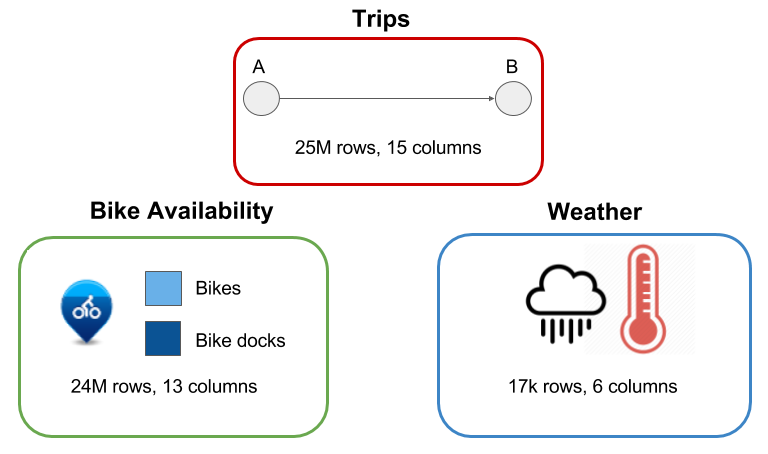
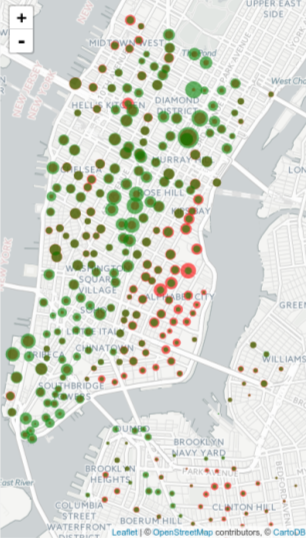
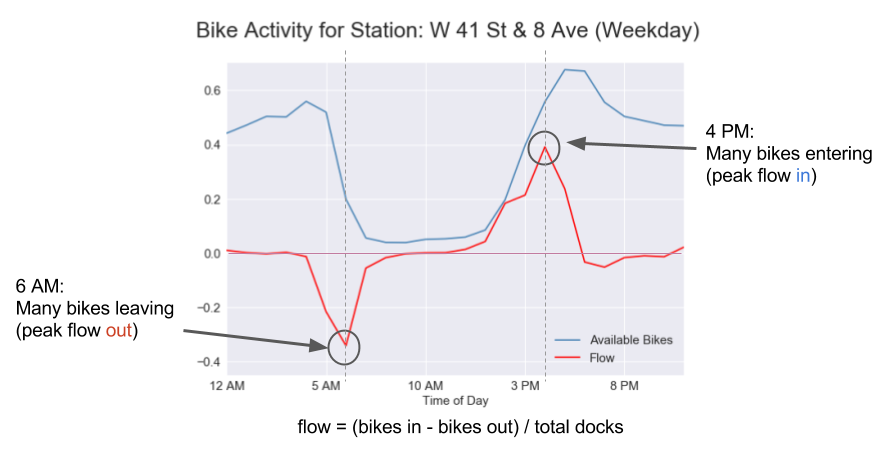
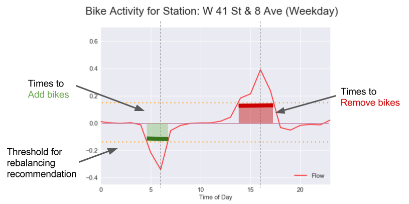
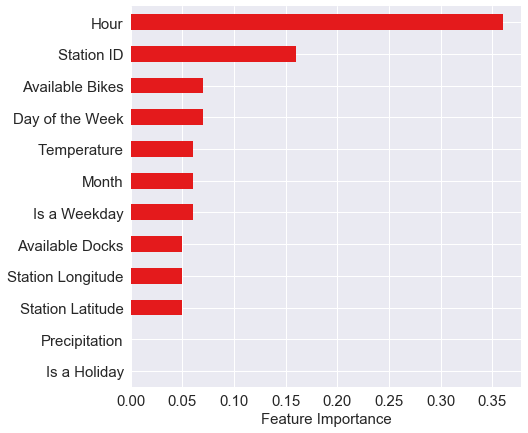
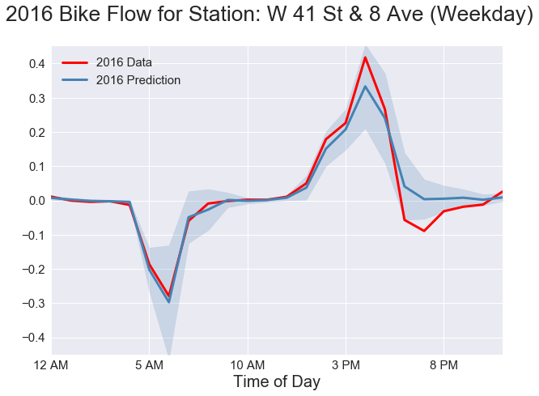
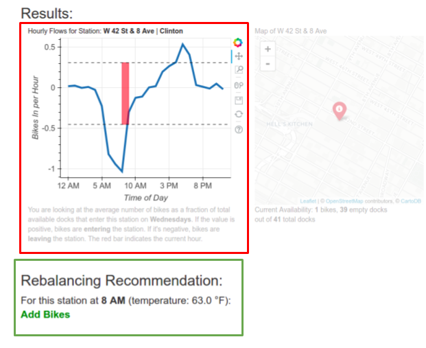

# BikeFlow

## Introduction

Citibike is a fun and fast way of getting around the city, where users check out a bike at a station and return it within a 45 minute window. But if you're a commuter, there are times when it is difficult to find a station with bikes, or conversely, finding a station with available docks. So Citibike tries to solve this problem by rebalancing: manually moving bikes from full stations to empty ones.

But figuring out a rebalancing strategy is a difficult problem, involving many different approaches and making many assumptions, including solving the traveling salesman network analysis problems using continuous time Markov chains. What I'm trying to do is predict the traffic in and out of a given station to see if that station needs to be rebalanced during the day.

## Data

I used data from three sources to make my predictions: trips, where each row describes where, when, and for how long a rider checked out a bike for a single trip, bike availability, each row describing how many bikes and docks are available for a given station at a given time, and hourly weather data (specifically temperature and precipitation) over the last two years. All routines for data cleaning and munging are found in `cleanup.py`, `concat_data.py`, `workflow/data.py`, and `workflow/features.py`. Schemas for SQL tables are found in `schema.sql`.

## General Weekday Pattern

Here's an overall view of rider activity on weekdays. The red circles are the number of bikes checked out at a given station in the morning, and we see that most riders start their trips in residential areas like the East Village and Chelsea. The green circles show the number of bikes checked out in the evening. So there is a pattern of behavior where bikes move from residential areas to commercial areas and back again over the course of the day.

## Particular Station Pattern

If we zoom in on one station (W 42nd St & 8th Ave), we can see a similar pattern on weekdays. The blue line shows how many bike are available as a fraction of total docks. In the morning there are a lot of bikes, but at a certain time, people start checking them out until the station is nearly depleted. Then in the afternoon, the availability increases again as commuters start returning bikes and fill up the station.

So why don't we just use bike availablity to make our predictions? Because bike availability by itself does not take into account the variabilty of station sizes and how quickly people check out and return bikes, which are the real indicators of bike demand. The flow is negative if bikes are leaving the station and positive if bikes are entering a station. (What we have essentially is a first derivative of bike availability)

We can also see that at maximum negative flow, there there are still bikes leaving the station, giving us advance warning of when the station would be depleted. Similarly, we see a similar effect at the end of the day when we have peak flow back into the station.

## Thresholding for Rebalancing Recommendation

But it would be better to find a window of times to suggest rebalancing. We do this by establishing a threshold of flow, above or below which would trigger a rebalancing recommendation. If the flow falls below the threshold, we should add bikes, and if it rises above the threshold, we should remove them. Mean flow tends to be around 0, so a good threshold to use is one standard deviation above and below the mean.

## Modeling

To make the prediction, I employed a random forest regressor that takes into account the following features, the most important of which are time of day, station number, and the day of the week. I trained the model on 2015 data and tested it on 2016 data. The relevant code is found in `modeling.py`.

Looking at the 2016 data for this station, we can see that the prediction for 2016 fits the data quite well, within one standard deviation of the prediction.

## App

I have developed a web app called [BikeFlow](http://www.cbalancer.site) that uses current station availability and weather data to make a prediction of the current flow based on the model. It shows a profile of the flow of the station based on historical data and the current hour displayed in red. It also displays a rebalancing recommendation based on the prediction. All code for the website is found in the `websitetools/` folder.
